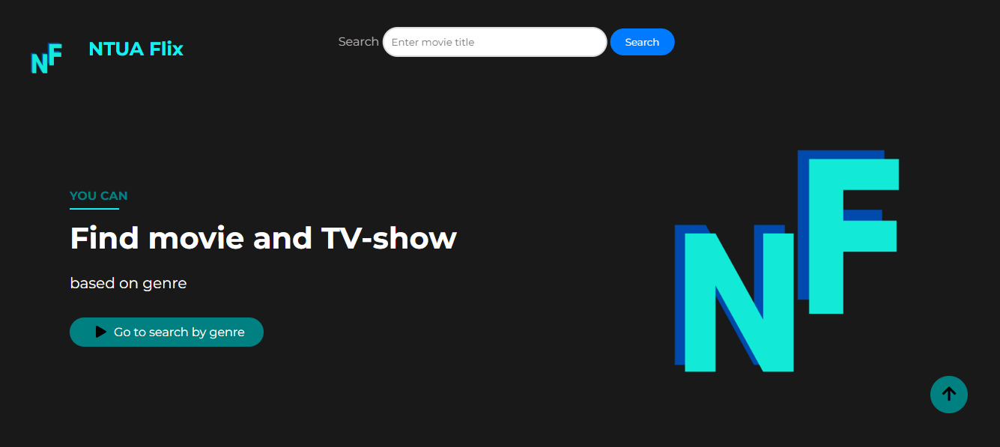

# Front-end

Ενδεικτικά περιεχόμενα:

- Front-end παρουσίασης δεδομένων σε περιβάλλον web.

 

 

Αποτελείται από το public file, στο οποίο υλοποιούμε τα εξής:

- [**index_homepage.html**](https://github.com/ntua/softeng23-55/blob/main/front-end/public/index_homepage.html) - HTML file for the homepage for our website .
- [**homepage.js**](https://github.com/ntua/softeng23-55/blob/main/front-end/public/homepage.js) -Javascript file for the homepage
- [**itrendingMovies.js**](https://github.com/ntua/softeng23-55/blob/main/front-end/public/itrendingMovies.js) -Javascript file for the homepage(return some static data)
- [**results.html**](https://github.com/ntua/softeng23-55/blob/main/front-end/public/results.html)  -HTML file for the page of results from searchbar 
- [**results.js**](https://github.com/ntua/softeng23-55/blob/main/front-end/public/results.js) -Javascript file for the results from searchbar 
- [**index_movie_details.html**](https://github.com/ntua/softeng23-55/blob/main/front-end/public/index_movie_details.html) -HTML file for the movie & tv show details
- [**movie.js**](https://github.com/ntua/softeng23-55/blob/main/front-end/public/movie.js) -Javascript file for movie details (return movie details)
- [**castandcrew.js**](https://github.com/ntua/softeng23-55/blob/main/front-end/public/castandcrew.js) -Javascript file includes all who were involved in  production
- [**index_actor_details.html**](https://github.com/ntua/softeng23-55/blob/main/front-end/public/index_actor_details.html) -HTML file for the cast & crew details
- [**actordetails.js**](https://github.com/ntua/softeng23-55/blob/main/front-end/public/actordetails.js)-Javascript file for cast&crew details (return cast&crew details)
- [**workofactor.js**](https://github.com/ntua/softeng23-55/blob/main/front-end/public/workofactor.js)-Javascript file includes work of cast&crew
- [**bygenre.html**](https://github.com/ntua/softeng23-55/blob/main/front-end/public/bygenre.html) -HTML file where you can find Movie & Tv Show based by genre
- [**genre.js**](https://github.com/ntua/softeng23-55/blob/main/front-end/public/genre.js)-Javascript file return the Movie & Tv Show based by genre
- [**main.css**](https://github.com/ntua/softeng23-55/blob/main/front-end/public/main.css) -CSS file for styling the main content.

Χρησιμοποιήθηκαν οι εξής φωτογραφίες και τα υπόλοιπα γραφικά υλοποιήθηκαν στη main.css

